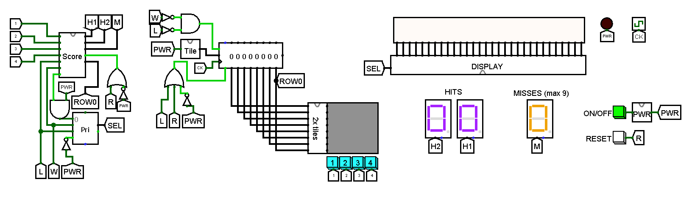
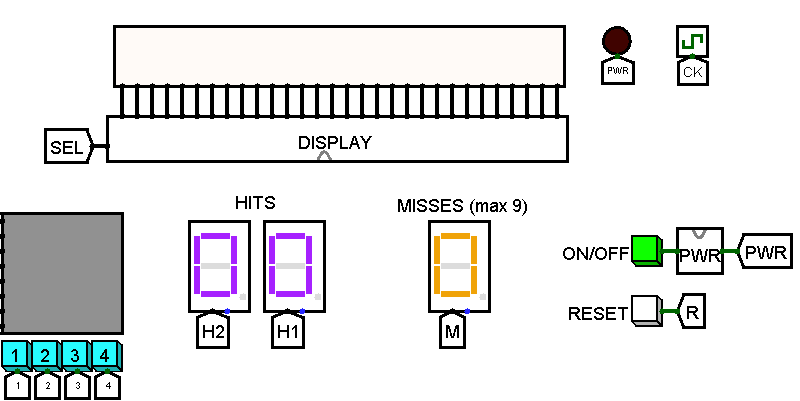
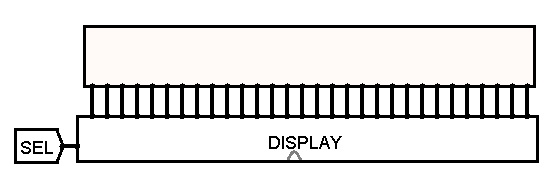
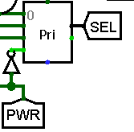
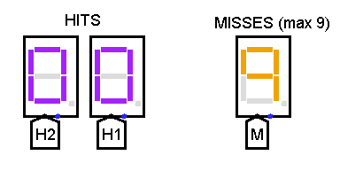
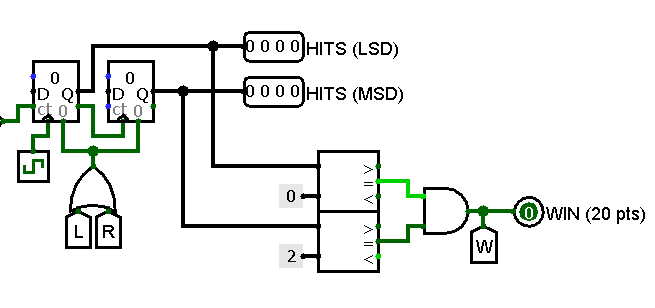
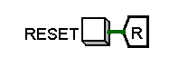
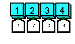

---
author:
- |
  Andrei Ciulpan\
 
title: |
  Relazione del progetto di Architetture I\
  Guitar Hero in Logisim
---

Introduzione
============

Il progetto consiste nel simulare il gioco \"Guitar Hero\" in cui un
giocatore ha il compito di premere dei bottoni nel momento opportuno per
guadagnare dei punti. Per momento opportuno intendo il momento in cui i
\"tiles\" arrivano in fondo della schermata di gioco.\
Per presentare il progetto ho deciso di seguire un approccio top-down in
cui parto dalla figura in cui esso viene rappresentato nella sua
interezza (Figura 1) per poi continuare descrivendo le varie parti che
lo compongono.

Board di Gioco
==============

La board di gioco è rappresentata da:

1.  una matrice LED 8x8 per visualizzare i \"tiles\"

2.  una matrice LED 4x30 per visualizzare i messaggi di \"YOU WON\"
    oppure \"YOU LOST\" a fine partita

3.  due HEX digit display per il conteggio dei punti (max 20) e un HEX
    digit display per il conteggio degli errori (max 9)

4.  bottone di ON/OFF

5.  bottone di RESET

6.  4 bottoni usati per il gameplay

Ogni componente enumerato verrà trattato nel dettaglio nelle seguenti
sottosezioni.

Matrice LED 8x8 e l'effetto dei \"tiles\" cadenti
-------------------------------------------------

La matrice LED 8x8 è pilotata da un shift register a 8 stadi (una per
ogni riga della matrice). Il shift register riceve in ingresso un numero
pseudo-random su 4 bit dal componente chiamato \"Tile\". Questo numero
su 4 bit, appena entrato nel shift register, accenderà (o non), dopo
aver passato nel circuito \"Tile doubler\", due celle adiacenti
dell'ultima riga della matrice LED (questa scelta è stata fatta per
poter avere una matrice piu' grande e quindi per poter allineare bene i
bottoni con le colonne della matrice). Al colpo di clock successivo
questo numero è shiftato a destra e accenderà quindi le due celle
adiacenti della riga sottostante dando l'effetto dei \"tiles\" cadenti.\
Nei paragrafi successivi descriverò il modo in cui i \"tiles\" vengono
raddoppiati e come vengono generati questi numeri casuali all'interno
del componente \"Tile\".

### Circuito che raddoppia i \"tiles\"

Questo componente riceve all'ingresso un numero su 4 bit e da in uscita
un numero su 8 bit dopo aver raggruppato due bit adiacenti alla volta in
modo che abbiano lo stesso valore. Questo lavoro è svolto grazie al modo
in cui si possono collegare i bit dei vari splitter tra di loro. Siccome
il nostro circuito può ricevere in ingresso soltanto un valore tra 0, 1,
2, 4 e 8 alla volta (grazie al circuito \"Tile Generator\"), mi limiterò
a scrivere le uscite solo per questi valori:

-   1000 1100 0000

-   0100 0011 0000

-   0010 0000 1100

-   0001 0000 0011

-   0000 0000 0000

Guardando le uscite del nostro componente possiamo notare che nella
nostra matrice LED ci saranno sempre 2 pixel adiacenti accesi (o
spenti).

### Circuito per la generazione casuale dei \"tiles\"

Nella figura 4 si può notare un componente che si chiama Random
Generator. Esso è impostato per generare un numero pseudo-random su 4
bit che poi entrerà (dopo alcune modifiche) nello shift register che
pilota la matrice LED. Il generatore dei numeri random, essendo su 4
bit, genera un numero da 0 a 15 ad ogni colpo di clock. Questo numero
viene poi dato ad un circuito SOP che attiva una (o nessuna) delle 4
linee in uscita (queste 4 linee rappresentano le colonne della matrice
LED e al piu' una linea può essere accesa alla volta).\
\
Particolarmente:

-   la linea 0 viene attivata quando il numero generato è 1 oppure 9

-   la linea 1 viene attivata quando il numero generato è 2 oppure 10

-   la linea 2 viene attivata quando il numero generato è 4 oppure 13

-   la linea 3 viene attivata quando il numero generato è 8 oppure 14

-   in tutti gli altri casi le linee sono messe a 0 e quindi non abbiamo
    nessun \"tile\" in quel istante

In questo modo ad ogni ciclo di clock c'è una probabilità di 50% di
trovare un tile, dopo aver raddoppiato i pixel, su esattamente due delle
otto colonne.

Matrice LED 4x30 e la visualizzazione dei messaggi a fine partita
-----------------------------------------------------------------

Su questa matrice LED, pilotata dal componente \"DISPLAY\", si possono
visualizzare i seguenti messaggi:

-   \"YOU WON\" dopo aver guadagnato 20 punti

-   \"YOU LOST\" dopo aver sbagliato 9 volte

-   \"PLAY\" durante il gameplay

### Circuito per visualizzare i messaggi

La matrice LED 4x30 è indirizzata per colonna, perciò bisogna
indirizzare 30 colonne. Ogni elemento nella figura 6 indirizza una sola
colonna della matrice. Mandando dei segnali costanti opportuni possiamo
accendere solo alcune righe di ciascuna colonna e quindi scrivere
qualsiasi lettera. Ogni colonna può essere indirizzata da 4 valori
diversi (ciò è scelto dal MUX a 2 vie), tramite il segnale di selezione
SEL a 2 bit, a seconda delle necessità:

-   SEL = 00 \"PLAY\"

-   SEL = 01 \"YOU WON\"

-   SEL = 10 \"YOU LOST\"

-   SEL = 11 Matrice LED spenta (il circuito è spento)

Il segnale di selezione viene ricevuto da un encoder (che si può vedere
in figura 7). L'encoder manderà in uscita una sequenza su 2 bit in base
a quale linea è accesa al suo ingresso:

-   SEL = 00 la prima linea è accesa (l'uscita \"IN PROGRESS\" del
    componente che calcola lo score messa in AND con la linea ON/OFF)

-   SEL = 01 la seconda linea è accesa (l'uscita \"WIN\" del componente
    che calcola lo score)

-   SEL = 10 la terza linea è accesa (l'uscita \"LOSE\" del componente
    che calcola lo score)

-   SEL = 11 la quarta linea è accesa (l'uscita negata della linea di
    ON/OFF)

Conteggio dei punti e degli errori
----------------------------------

In questa fase utilizziamo i tre HEX digit display (due per i punti, uno
per gli errori)

### Conteggio dei punti

Nella figura 9.b) si possono vedere 2 contatori su 4 bit messi in
sequenza. Il primo (quello piu' a sinistra) conta fino a 9 e quando lo
supera (il contatore sente il clock sul falling edge) alza la linea di
carry che poi fa da clock al secondo contatore. In questo modo il primo
contatore torna a 0 dopo aver mandato il carry al secondo contatore che
a sua volta incrementa di 1. I valori del primo e del secondo contatore
vanno poi mandati in uscita come due sequenze di 4 bit (una che
rappresenta le unità $LSD$ e l'altro le decine $MSD$). Ciascuna sequenza
pilota uno dei due display nella figura 9.a).\
Inoltre l'uscita WIN è pilotata dalle uscite di 2 comparatori messe in
AND. I comparatori alzano la loro linea di uscita quando i due contatori
segnano rispettivamente 0 per LSD e 2 per MSD (ovvero quando si arriva a
20).\
Come detto prima questo segnale di WIN attiva il circuito adatto che
pilota il display per poter visualizzare il messaggio \"YOU WON\".\
Il circuito che manda i segnali di HIT che incrementano i contatori è
presentato nella sezione 2.6.

### Conteggio degli errori

Nella figura 10.b) si può vedere un contatore su 4 bit che è impostato a
poter contare solo fino a 9. Il valore del contatore viene mandato fuori
dal circuito come una sequenza di 4 bit che poi entrerà nel display che
si può vedere nella figura 10.a). Quando supera il 9 (il contatore è
impostato a sentire il falling edge del clock) esso aumenta la linea di
carry che poi sarà il nostro segnale di LOSE.\
Il circuito che manda i segnali di MISS che incrementano il contatore è
presentato nella sezione 2.6.

Circuito di ON/OFF
------------------

Il circuito di accensione/spegnimento nella figura 11.b) è implementato
da un contatore su 1 bit (e quindi che conta solo fino a 1). Quando
viene premuto il bottone di ON/OFF nella figura 11.a), durante il rising
edge del clock, il contatore aumenta a 1. Quando il bottone viene
premuto di nuovo il contatore è già in overflow e passa a 0 (grazie
all'impostazione di wrap around) e cosi' via.

Reset
-----

Il segnale di RESET fa tornare il gioco allo stato iniziale che si ha
subito dopo l'accensione. Questo viene fatto azzerrando lo stato del
shift register e dei contatori.

I 4 bottoni per il gameplay e l'interazione con lo stato del gioco
------------------------------------------------------------------

I 4 bottoni rappresentano 4 input per il circuito che calcola lo score.
Inoltre in questo circuito entra anche la sequenza di 4 bit uscente
dall'ultimo stadio dello shift register che, come detto nella sezione
2.1, pilota la prima riga della matrice LED 8x8 (ROW 0). Questi 8 bit
rappresentano i i nostri input nel circuito score che influiscono sullo
stato della macchina.

### Interazione degli input con lo stato del gioco

Nella figura 14 si possono vedere gli 8 input del nostro circuito (tra
cui 4 arrivano dai bottoni per il gameplay e gli altri 4 arrivano
dall'ultimo stadio del nostro shift register (ovvero ROW 0).\
La parte in alto che rappresenta la SOP è utilizzata per pilotare il
contatore degli HIT (e.g. che incrementa quando il bottone 1 è premuto e
contemporaneamente la linea che rappresenta la prima colonna della riga
0 è accesa).\
La parte in basso che rappresenta la POS è utilizzata per pilotare il
contatore dei MISS (e.g che incrementa quando è accesa la linea che
rappresenta la prima colonna della riga 0 ma il bottone 1 non è stato
premuto e quindi la linea B1 è spenta)

Conclusioni
===========

Per realizzare il circuito sono partito dall'implementazione della board
di gioco con il shift registe e la matrice LED, che inizalmente era 8x2.
Poi ho rifatto la stessa cosa su una scala piu' grande (matrice LED 8x8)
e infine ho aggiunto lo score e la matrice per visualizzare i messaggi a
fine partita.\
\
Miglioramenti possibili:

-   aumentare la scala della board di gioco

-   risolvere un bug derivato dallo stato del gioco dopo aver vinto (il
    contatore non dovrebbe piu' aumentare)

-   possibilità di selezionare la difficoltà con un circuito che aumenta
    la probabilità di generare i \"tiles\".

